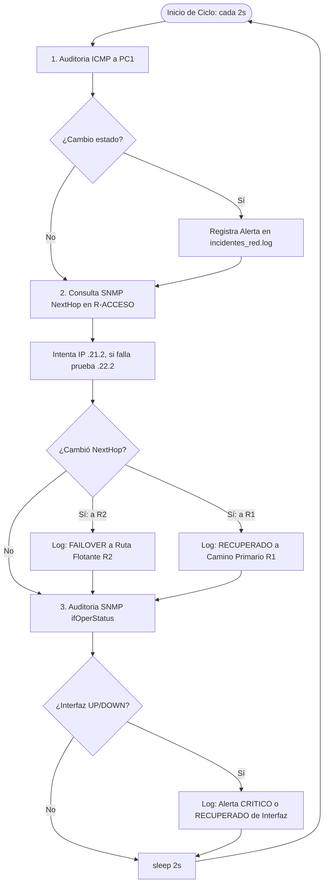

# Documentación Técnica y Guía de Laboratorio: Sistema de Enrutamiento L3 con Alta Disponibilidad y Telemetría NMS

Esta documentación tiene como propósito servir de guía exhaustiva, técnica y didáctica para entender, desplegar, auditar y exponer este proyecto. Ha sido diseñada tanto para compañeros de equipo que se incorporan al laboratorio como para evaluadores técnicos.

---

## Tabla de Contenidos
1. [Introducción a Containerlab](#1-introducción-a-containerlab)
2. [Estructura del Repositorio](#2-estructura-del-repositorio)
3. [Laboratorio y Artefactos: topology.clab.yml y clab-enrut-ha](#3-laboratorio-y-artefactos-topologyclabyml-y-clab-enrut-ha)
4. [Configuración de Dispositivos (Carpeta configs/)](#4-configuración-de-dispositivos-carpeta-configs)
5. [FRRouting (FRR) en Profundidad](#5-frrouting-frr-en-profundidad)
6. [Monitoreo y Agente SNMP](#6-monitoreo-y-agente-snmp)
7. [Estación de Gestión y Telemetría (Carpeta nms/)](#7-estación-de-gestión-y-telemetría-carpeta-nms)
8. [Scripts de Auditoría y Pruebas (Carpeta scripts/)](#8-scripts-de-auditoría-y-pruebas-carpeta-scripts)
9. [Diagrama Conceptual y Arquitectura de Red](#9-diagrama-conceptual-y-arquitectura-de-red)
10. [Flujo Completo del Proyecto](#10-flujo-completo-del-proyecto)
11. [Guía de Uso Paso a Paso](#11-guía-de-uso-paso-a-paso)
12. [Troubleshooting (Resolución de Problemas)](#12-troubleshooting-resolución-de-problemas)
13. [Guion para Explicar el Proyecto (Demostración)](#13-guion-para-explicar-el-proyecto-demostración)
14. [Observaciones Técnicas e Inconsistencias Detectadas](#14-observaciones-técnicas-e-inconsistencias-detectadas)

---

## 1. Introducción a Containerlab

### ¿Qué es Containerlab?
**Containerlab** (`clab`) es una herramienta de código abierto diseñada para orquestar y desplegar laboratorios de redes basados en contenedores. A diferencia de los entornos tradicionales de virtualización de redes (como GNS3 o EVE-NG), Containerlab elimina la necesidad de emuladores pesados de hardware (como Dynamips o QEMU) para cada router.

### ¿Para qué se utiliza?
Se utiliza para crear topologías de red complejas de forma rápida, automatizada y reproducible, facilitando:
* Pruebas de protocolos de enrutamiento (OSPF, BGP, rutas estáticas con failover).
* Validación de políticas de seguridad y telemetría (SNMP, gNMI, NetFlow).
* Pruebas de integración continua (CI/CD) para infraestructura de red (*NetDevOps*).
* Prototipado rápido sin saturar la memoria RAM del equipo de cómputo.

### ¿Cómo funciona conceptualmente y cuál es su relación con Docker?
Containerlab no implementa un motor de contenedores propio; se apoya directamente en **Docker** (o Podman). 
* Cada dispositivo de la red (router, switch, servidor de monitoreo o cliente) es un **contenedor Docker**.
* Las conexiones físicas entre interfaces (cables de red virtuales) se implementan mediante **pares de interfaces virtuales Ethernet de Linux (`veth pairs`)**.
* Cuando Containerlab lee la topología, le indica al kernel de Linux que cree pares `veth` y mueva cada extremo dentro del espacio de nombres de red (*network namespace*) del contenedor correspondiente.

### Conceptos Fundamentales
1. **Archivo de Topología (`*.clab.yml`)**: Es un documento declarativo en formato YAML donde se define el nombre del laboratorio, qué contenedores (nodos) existirán, qué imágenes de Docker utilizarán, qué configuraciones locales se montarán y cómo estarán interconectados.
2. **Nodos (`nodes`)**: Son las instancias de los equipos de red. En nuestro proyecto existen 6 nodos: 4 routers (`r-gestion`, `r1`, `r2`, `r-acceso`), 1 estación de gestión (`nms`) y 1 cliente (`pc1`).
3. **Enlaces (`links`)**: Definen la conectividad física virtual punto a punto entre interfaces de dos nodos (por ejemplo: `["r1:eth3", "r-acceso:eth1"]`).
4. **Laboratorio vs. Contenedores vs. Bind Mounts**:
   * **El Laboratorio**: Es el conjunto completo (red de gestión, contenedores, enlaces `veth` y variables de entorno).
   * **Los Contenedores**: Son las instancias en ejecución de las imágenes base (ej. `frr-snmp:latest`, `alpine:3.19`).
   * **Bind Mounts**: Son enlaces directos entre archivos/carpetas de tu máquina host y el interior del contenedor. Permiten inyectar configuraciones locales (`frr.conf`, `snmpd.conf`, scripts) dentro de `/etc/frr/` o `/etc/snmp/` sin tener que reconstruir la imagen Docker cada vez que se hace un cambio.

#### Ejemplo Sencillo de Topología Containerlab
```yaml
name: mini-lab
topology:
  nodes:
    router1:
      kind: linux
      image: frrouting/frr:latest
      binds:
        - configs/r1.conf:/etc/frr/frr.conf
    cliente1:
      kind: linux
      image: alpine:latest
      cmd: "sleep infinity"
  links:
    - endpoints: ["router1:eth1", "cliente1:eth1"]
```

---

## 2. Estructura del Repositorio

La estructura real de archivos y directorios del proyecto en el sistema es la siguiente:

```text
Sistema_Enrut/
├── PLAN_FASES.md                 # Especificación técnica y hoja de ruta de la arquitectura
├── topology.clab.yml             # Manifiesto maestro de la topología en Containerlab
├── clab-enrut-ha/                # Directorio autogenerado por Containerlab en el despliegue
│   ├── .state.clab.yaml          # Estado interno del laboratorio gestionado por clab
│   ├── .tls/                     # Certificados y CA interna generados para los nodos
│   ├── ansible-inventory.yml     # Inventario de hosts en formato Ansible autogenerado
│   ├── nornir-simple-inventory.yml # Inventario de hosts para el framework Nornir
│   ├── topology-data.json        # Volcado completo con metadatos de nodos, IPs y enlaces
│   └── authorized_keys           # Claves públicas SSH para inyección en los nodos
├── configs/                      # Archivos de configuración de los routers del laboratorio
│   ├── Dockerfile.frr-snmp       # Dockerfile para construir la imagen con FRR + Net-SNMP
│   ├── r-acceso/                 # Router de Acceso (Gateway de clientes y failover SLA)
│   │   ├── daemons               # Daemons de FRR activos (zebra, staticd, bfdd)
│   │   ├── frr.conf              # Configuración de interfaces y rutas en FRR
│   │   ├── snmpd.conf            # Configuración del agente SNMP (comunidad redes2026)
│   │   └── sla_tracker.sh        # Script de sondeo activo y conmutación de ruta por defecto
│   ├── r-gestion/                # Router del Plano de Gestión Fuera de Banda (OOB)
│   │   ├── daemons               # Daemons de FRR activos
│   │   ├── frr.conf              # Interfaces y rutas estáticas de gestión
│   │   └── snmpd.conf            # Configuración de SNMP
│   ├── r1/                       # Router Core Primario (anuncia IP de servicio 8.8.8.8)
│   │   ├── daemons               # Daemons de FRR activos
│   │   ├── frr.conf              # Configuración de Loopback, troncal y enlace primario
│   │   └── snmpd.conf            # Configuración de SNMP
│   └── r2/                       # Router Core Secundario (anuncia IP de servicio 8.8.8.8)
│       ├── daemons               # Daemons de FRR activos
│       ├── frr.conf              # Configuración de Loopback, troncal y enlace respaldo
│       └── snmpd.conf            # Configuración de SNMP
├── nms/                          # Estación Central de Telemetría y Monitoreo (NMS)
│   ├── Dockerfile                # Receta Docker para construir la imagen nms-telemetry
│   ├── monitor_definitivo.py     # Demonio en Python que sondea ICMP, SNMP y reporta fallos
│   └── incidentes_red.log        # Bitácora forense donde se registran eventos y alertas
└── scripts/                      # Scripts para pruebas automatizadas y demostraciones
    ├── test_failover.sh          # Simula caída de enlace primario y valida alta disponibilidad
    └── verify_snmp.sh            # Realiza consultas SNMP puntuales a todos los routers
```

### Relación y Ciclo de Vida entre Componentes
1. **Fase de Construcción (Build)**: Se compilan las imágenes locales:
   * `configs/Dockerfile.frr-snmp` produce la imagen `frr-snmp:latest`.
   * `nms/Dockerfile` produce la imagen `nms-telemetry:latest`.
2. **Fase de Orquestación (Deploy)**: `topology.clab.yml` es interpretado por Containerlab:
   * Instancia los 6 contenedores Docker.
   * Monta los archivos de `configs/` dentro de cada contenedor.
   * Crea las interfaces virtuales (`eth1`, `eth2`, `eth3`) y los enlaces cruzados.
   * Ejecuta los comandos iniciales definidos bajo la clave `exec:`.
   * Genera la carpeta `clab-enrut-ha/` con los inventarios de automatización.
3. **Fase Operativa**:
   * En `r-acceso`, `sla_tracker.sh` corre en segundo plano monitoreando a R1.
   * En `nms`, `monitor_definitivo.py` audita continuamente las interfaces y la ruta activa mediante SNMP y registra cualquier contingencia en `incidentes_red.log`.
4. **Fase de Validación**:
   * El operador o evaluador ejecuta `scripts/verify_snmp.sh` o `scripts/test_failover.sh` para verificar el comportamiento de la red.

---

## 3. Laboratorio y Artefactos: topology.clab.yml y clab-enrut-ha

### El archivo `topology.clab.yml`
Es el núcleo declarativo del proyecto. Define los siguientes aspectos clave:
* `name: enrut-ha`: Nombre del laboratorio. Containerlab crea automáticamente un prefijo de carpeta de trabajo llamado `clab-<name>`, es decir, `clab-enrut-ha`.
* `prefix: ""`: Evita que Containerlab añada prefijos largos a los nombres de los contenedores Docker. Así, el contenedor se llama limpiamente `r1` en lugar de `clab-enrut-ha-r1`.
* `nodes`:
  * `nms`: Nodo basado en `nms-telemetry:latest`. Monta `nms:/app`. Configura IPs estáticas de gestión y rutas hacia `192.168.0.0/16` y `10.0.0.0/8` vía `192.168.10.1`.
  * `r-gestion`: Router central OOB. Monta sus configuraciones FRR y SNMP. Habilita reenvío de paquetes (`sysctl -w net.ipv4.ip_forward=1`), arranca el daemon `snmpd` y define rutas hacia las subredes punto a punto y de clientes.
  * `r1` y `r2`: Routers de Core con interfaces loopback simulando el servicio `8.8.8.8/32`.
  * `r-acceso`: Router que sirve de puerta de enlace al cliente `pc1`. Monta `sla_tracker.sh` en `/usr/local/bin/sla_tracker.sh` y define rutas por defecto con métricas 1 y 10.
  * `pc1`: Host emulado basado en `alpine:3.19` que ejecuta `sleep infinity`, con IP `192.168.20.50/24` y puerta de enlace `192.168.20.1`.
* `links`:
  * **Gestión OOB**: `nms:eth1 <-> r-gestion:eth1`, `r-gestion:eth2 <-> r1:eth1`, `r-gestion:eth3 <-> r2:eth1`.
  * **Core Troncal P2P**: `r1:eth2 <-> r2:eth2`.
  * **Acceso y Clientes**: `r1:eth3 <-> r-acceso:eth1`, `r2:eth3 <-> r-acceso:eth2`, `r-acceso:eth3 <-> pc1:eth1`.

### Artefactos en `clab-enrut-ha/`
Cuando Containerlab ejecuta `clab deploy`, genera automáticamente este directorio con herramientas listas para NetDevOps:
* **`ansible-inventory.yml`**: Inventario estructurado en formato YAML compatible con Ansible. Permite ejecutar playbooks directamente contra las IPs de la red de gestión Docker (`172.20.20.0/24`):
  * `nms`: 172.20.20.2
  * `r2`: 172.20.20.3
  * `r-acceso`: 172.20.20.4
  * `r1`: 172.20.20.5
  * `r-gestion`: 172.20.20.6
  * `pc1`: 172.20.20.7
* **`nornir-simple-inventory.yml`**: Inventario para el framework de automatización en Python **Nornir**, mapeando cada nodo con su hostname IP y plataforma `linux`.
* **`topology-data.json`**: Diccionario JSON completo con metadatos del laboratorio: nombres FQDN (`r1.enrut-ha.io`), bridge de Docker utilizado, direcciones IPv4/IPv6 de gestión y rutas a los directorios locales.
* **`authorized_keys`**: Archivo reservado para inyectar claves públicas SSH en los contenedores para permitir accesos desatendidos vía Ansible/SSH.
* **`.tls/`**: Contiene la Autoridad Certificadora (CA) y certificados X.509 generados por Containerlab para comunicaciones seguras TLS/gNMI si los nodos las soportan.

---

## 4. Configuración de Dispositivos (Carpeta configs/)

Cada carpeta dentro de `configs/` representa la personalidad de red de un router:

```text
configs/
├── Dockerfile.frr-snmp
├── r-acceso/
├── r-gestion/
├── r1/
└── r2/
```

### 1. `Dockerfile.frr-snmp`
* **Base**: `frrouting/frr:latest` (Alpine Linux con la suite FRR preinstalada).
* **Adiciones**: Instala mediante `apk` las herramientas `net-snmp` (servidor snmpd), `net-snmp-tools` (cliente snmpget/snmpwalk) e `iputils` (ping, arping).
* **Propósito**: Proveer una imagen homogénea que combine capacidades de enrutamiento avanzado con soporte completo de MIB-II para telemetría.

### 2. Router `r-acceso` (Router de Acceso y Gateway de Clientes)
* **Función**: Gateway para la red de clientes `192.168.20.0/24`. Conecta con R1 (camino primario) y R2 (camino de respaldo).
* **Archivos**:
  * `daemons`: Activa `zebra=yes`, `staticd=yes` y `bfdd=yes`. Mantiene apagados daemons de enrutamiento dinámico como OSPF o BGP.
  * `frr.conf`: Configura `eth1` (192.168.21.2/30), `eth2` (192.168.22.2/30) y `eth3` (192.168.20.1/24). Define dos rutas por defecto:
    ```text
    ip route 0.0.0.0/0 192.168.21.1 1    ! Ruta primaria con distancia/métrica 1
    ip route 0.0.0.0/0 192.168.22.1 10   ! Ruta flotante con distancia/métrica 10
    ```
  * `snmpd.conf`: Expone el agente SNMP en el puerto UDP 161 con comunidad `redes2026`.
  * `sla_tracker.sh`: Script en shell que emula el comportamiento de **Cisco IP SLA + Object Tracking**.

#### Funcionamiento de `sla_tracker.sh`
```sh
TARGET="192.168.21.1"  # IP del enlace primario hacia R1
BACKUP="192.168.22.1"  # IP del enlace de respaldo hacia R2
```
1. Inicializa la tabla de rutas del kernel instalando la ruta principal vía `eth1` (métrica 1) y la ruta secundaria vía `eth2` (métrica 10).
2. Cada 2 segundos envía una sonda ICMP (`ping -c 1 -W 1 -I eth1 192.168.21.1`).
3. Si el ping falla, realiza una confirmación secundaria tras 1 segundo.
4. Si se confirma la caída y el estado era `UP`, ejecuta:
   * `ip route del default via 192.168.21.1 dev eth1`: Al eliminar la ruta de métrica 1, el kernel de Linux conmuta instantáneamente el tráfico a la ruta flotante de respaldo (`192.168.22.1`).
   * Escribe el incidente en `/var/log/sla_tracker.log`.
5. Cuando R1 vuelve a responder, reinyecta la ruta primaria con métrica 1 y registra la restauración.

### 3. Router `r-gestion` (Plano de Gestión Fuera de Banda - OOB)
* **Función**: Aísla el tráfico administrativo y de telemetría del tráfico de producción. Conecta directamente con el NMS y con los interfaces de gestión de R1 y R2.
* **Archivos**:
  * `frr.conf`: Direcciona `eth1` (192.168.10.1/24 hacia NMS), `eth2` (192.168.11.1/30 hacia R1) y `eth3` (192.168.12.1/30 hacia R2).
  * Rutas hacia la subred de clientes `192.168.20.0/24`:
    * Vía R1 (`192.168.11.2`) de forma preferente.
    * Vía R2 (`192.168.12.2`, métrica 10) como ruta flotante.

### 4. Router `r1` (Core Primario)
* **Función**: Enrutador principal de servicios. Simula el destino de Internet o servicio corporativo mediante la interfaz `lo` con IP `8.8.8.8/32`.
* **Archivos**:
  * `frr.conf`:
    * `lo`: `8.8.8.8/32`.
    * `eth1`: `192.168.11.2/30` hacia R-GESTION.
    * `eth2`: `10.0.0.1/30` (Enlace troncal P2P hacia R2).
    * `eth3`: `192.168.21.1/30` (Enlace de servicio hacia R-ACCESO).
    * Ruta hacia clientes: `192.168.20.0/24` vía R-ACCESO (`192.168.21.2`), y vía troncal hacia R2 (`10.0.0.2`, métrica 10).

### 5. Router `r2` (Core Respaldo)
* **Función**: Enrutador redundante de respaldo. Mantiene también la IP de servicio `lo: 8.8.8.8/32`.
* **Archivos**:
  * `frr.conf`:
    * `lo`: `8.8.8.8/32`.
    * `eth1`: `192.168.12.2/30` hacia R-GESTION.
    * `eth2`: `10.0.0.2/30` (Troncal P2P hacia R1).
    * `eth3`: `192.168.22.1/30` (Enlace de servicio respaldo hacia R-ACCESO).
    * Rutas estáticas de retorno hacia clientes (`192.168.20.0/24`) y plano de gestión.

---

## 5. FRRouting (FRR) en Profundidad

### ¿Qué es FRRouting?
**FRRouting (FRR)** es una suite de protocolos de enrutamiento IP de código abierto para plataformas Linux y Unix. Es el sucesor directo del proyecto Quagga y ofrece una arquitectura modular basada en demonios específicos para cada protocolo de red.

### ¿Por qué se utiliza en este laboratorio?
* **Rendimiento y Ligereza**: Consume una fracción mínima de memoria RAM (alrededor de 20-30 MB por instancia), permitiendo correr múltiples routers sin sobrecargar el CPU.
* **Sintaxis estándar tipo Cisco IOS**: Su interfaz de línea de comandos (`vtysh`) emula casi a la perfección la CLI de Cisco IOS, facilitando el aprendizaje y la gestión.
* **Integración nativa con el kernel de Linux**: FRR delega el plano de datos al subsistema de red del kernel mediante el daemon `zebra`, permitiendo interactuar con herramientas clásicas de Linux como `iproute2`, `iptables` y scripts de bash.

### Rol de los archivos clave
* **`daemons`**: Archivo de arranque donde se habilita (`yes`) o deshabilita (`no`) cada subsistema de FRR. En este laboratorio, los routers activan únicamente:
  * `zebra=yes`: El daemon central que interactúa con la tabla de enrutamiento (FIB) del kernel de Linux.
  * `staticd=yes`: El daemon que gestiona las rutas estáticas configuradas en `frr.conf`.
  * `bfdd=yes`: Daemon de Detección de Reenvío Bidireccional (Bidirectional Forwarding Detection).
* **`frr.conf`**: Archivo maestro de configuración de red donde se definen nombres de host, interfaces, descripciones, direcciones IP y rutas estáticas.

### Comandos útiles en `vtysh`
Para interactuar con la consola de FRR en cualquier router:

```bash
# Ingresar a la shell interactiva de FRR
docker exec -it r1 vtysh

# Ver la configuración activa de FRR
r1# show running-config

# Ver la tabla de enrutamiento de Zebra / FRR
r1# show ip route

# Ver el estado detallado de las interfaces
r1# show interface brief
r1# show interface eth3

# Salir de vtysh
r1# exit
```

---

## 6. Monitoreo y Agente SNMP

### ¿Qué es SNMP y por qué se utiliza?
**SNMP (Simple Network Management Protocol)** es el protocolo estándar de la industria para monitorear, administrar y recopilar estadísticas de dispositivos de red. 
En este proyecto se utiliza **SNMPv2c** para permitir que la estación central de monitoreo (`nms`) audite el estado operativo de los enlaces físicos y verifique en tiempo real las decisiones de enrutamiento sin requerir acceso SSH a los routers.

### Rol de `snmpd.conf`
Cada router del laboratorio monta el mismo esquema de configuración:
```text
rocommunity redes2026
syslocation Lab Containerlab
syscontact admin@redes.local
agentaddress udp:161
```
* `rocommunity redes2026`: Define la clave o contraseña de solo lectura (*Read-Only Community String*). Solo quienes conozcan esta comunidad pueden consultar las MIBs.
* `agentaddress udp:161`: Indica al demonio que escuche solicitudes en todas las interfaces por el puerto UDP estándar 161.

### OIDs Clave de MIB-II utilizadas en el proyecto
El NMS consulta periódicamente los siguientes identificadores de objetos (OIDs):

| OID | Nombre MIB | Propósito en el Laboratorio |
| :--- | :--- | :--- |
| `1.3.6.1.2.1.1.5.0` | `sysName` | Identificar el nombre del router consultado (ej. R1, R2). |
| `1.3.6.1.2.1.2.2.1.2` | `ifDescr` | Obtener el nombre descriptivo de las interfaces (`eth1`, `eth2`, etc.). |
| `1.3.6.1.2.1.2.2.1.8` | `ifOperStatus` | Estado operativo de la interfaz: **1 = UP**, **2 = DOWN**. Permite detectar enlaces caídos. |
| `1.3.6.1.2.1.4.21.1.7.0.0.0.0` | `ipRouteNextHop` | Próximo salto (*Next-Hop*) de la ruta por defecto en `r-acceso`. Permite saber si el tráfico va hacia R1 (`.21.1`) o hacia R2 (`.22.1`). |

### Verificación manual de SNMP desde el NMS
```bash
# Consultar el nombre del equipo R1 desde el contenedor NMS
docker exec nms snmpget -v 2c -c redes2026 -Oqv 192.168.11.2 1.3.6.1.2.1.1.5.0

# Explorar las interfaces de R-ACCESO
docker exec nms snmpwalk -v 2c -c redes2026 -Oq 192.168.21.2 1.3.6.1.2.1.2.2.1.2
```

---

## 7. Estación de Gestión y Telemetría (Carpeta nms/)

La carpeta `nms/` implementa una solución de observabilidad autónoma basada en Python y Linux:

```text
nms/
├── Dockerfile
├── monitor_definitivo.py
└── incidentes_red.log
```

### 1. `nms/Dockerfile`
Construye una imagen ligera sobre `python:3.11-slim`:
* Instala utilitarios esenciales de diagnóstico de red: `iputils-ping`, `iproute2`, `traceroute`, `snmp`, `procps` y `curl`.
* Instala las librerías de Python `pysnmp-lextudio` y `requests`.
* Fija el directorio de trabajo en `/app` y mantiene el contenedor en espera con `sleep infinity`.

### 2. Motor de Telemetría: `monitor_definitivo.py`
Es un script en Python que ejecuta un bucle continuo de telemetría con un ciclo de polling de 2 segundos. Su arquitectura interna consta de tres fases:



#### Características Clave del Monitor:
* **Mecanismo Multi-Hop Resiliente para SNMP**: Si el enlace primario R1 ↔ R-ACCESO cae, el NMS no puede consultar a R-ACCESO por la IP `192.168.21.2`. El script implementa un array contingente:
  ```python
  R_ACCESO_IPS = ["192.168.21.2", "192.168.22.2"]
  ```
  Si la primera IP no responde, conmuta de inmediato a la segunda IP a través de R2 para no perder visibilidad.
* **Detección por Flanco (Edge-Triggered)**: No satura la bitácora con registros redundantes; solo escribe entradas cuando detecta una transición de estado (UP ↔ DOWN, o cambio de Next-Hop).

### 3. Bitácora Forense: `incidentes_red.log`
Registra los incidentes en tiempo real con marcas de tiempo estandarizadas:
```text
[2026-09-24 19:52:12] [INFO] Topologia en linea. Gateway activo en R-ACCESO: 192.168.21.1
[2026-09-24 19:52:48] [CRITICO] R1 -> eth3 cayo a DOWN!
[2026-09-24 19:54:16] [FAILOVER] ¡FALLA EN CAMINO PRIMARIO! Trafico REDIRIGIDO hacia R2 (192.168.22.1) via IP SLA / Ruta Flotante.
[2026-09-24 19:54:18] [RECUPERADO] PC1 Cliente (192.168.20.50) restablecio conectividad ICMP.
[2026-09-24 19:55:53] [RECUPERADO] ¡CAMINO PRIMARIO RESTABLECIDO! Trafico NORMALIZADO de vuelta a R1 (192.168.21.1).
```

---

## 8. Scripts de Auditoría y Pruebas (Carpeta scripts/)

### 1. `scripts/test_failover.sh`
Este script automatiza una prueba completa de resiliencia y alta disponibilidad:
1. **Verificación Nominal**: Envía 3 pings desde `pc1` hacia el servicio `8.8.8.8` a través del enlace principal.
2. **Inyección de Falla**: Desactiva el enlace primario en R1 ejecutando:
   ```bash
   docker exec r1 ip link set eth3 down
   ```
3. **Espera de Convergencia**: Duerme 4 segundos para permitir que `sla_tracker.sh` detecte la falla y actualice la tabla de rutas.
4. **Verificación de Enrutamiento**: Consulta la ruta por defecto activa en `r-acceso` (`docker exec r-acceso ip route show | grep default`).
5. **Validación de Continuidad de Tráfico**: Envía 3 pings desde `pc1` a `8.8.8.8` confirmando 0% de pérdida gracias al camino de respaldo vía R2.
6. **Restauración**: Vuelve a levantar la interfaz `eth3` en R1 (`ip link set eth3 up`) y espera 4 segundos a que el sistema vuelva a conmutar al camino preferente.
7. **Extracción Forense**: Imprime las últimas 10 líneas de `/app/incidentes_red.log` para corroborar que el NMS registró cada evento.

### 2. `scripts/verify_snmp.sh`
Script de auditoría rápida que valida la conectividad SNMP y las MIBs de los routers:
* Itera sobre las direcciones IP de gestión de los routers (`192.168.10.1`, `192.168.11.2`, `192.168.12.2`, `192.168.21.2`).
* Consulta la OID `sysName` (`1.3.6.1.2.1.1.5.0`) desde el NMS.
* Consulta el `ipRouteNextHop` de la ruta por defecto en `r-acceso` para certificar qué router Core está cursando el tráfico.

---

## 9. Diagrama Conceptual y Arquitectura de Red

La arquitectura del proyecto está estrictamente segmentada en tres planos:

```text
===================================================================================
                   PLANO DE GESTIÓN FUERA DE BANDA (OOB)
===================================================================================
                     ┌─────────────────────────────┐
                     │         Ubuntu NMS          │
                     │      192.168.10.10/24       │
                     │ (monitor_definitivo.py/SNMP)│
                     └──────────────┬──────────────┘
                                    │ eth1
                                    │ (192.168.10.0/24)
                                    │ eth1
                     ┌──────────────┴──────────────┐
                     │          R-GESTION          │
                     │       192.168.10.1/24       │
                     └──────┬───────────────┬──────┘
                   eth2 (.11.1)           eth3 (.12.1)
                   [192.168.11.0/30]      [192.168.12.0/30]
                            │                       │
============================│=======================│==============================
                   PLANO CORE Y SERVICIOS P2P       │
============================│=======================│==============================
                   eth1 (.11.2)           eth1 (.12.2)
                ┌───────────▼───┐       ┌───▼───────────┐
                │      R1       │       │      R2       │
                │   (Primario)  │ eth2  │  (Respaldo)   │
                │  Lo0: 8.8.8.8 ◄═══════►  Lo0: 8.8.8.8 │
                └───────┬───────┘ 10.0.0.0/30 ──┬───────┘
            eth3 (.21.1)│   Troncal P2P         │eth3 (.22.1)
      [192.168.21.0/30] │ (Métrica flotante 10) │ [192.168.22.0/30]
        Camino Primario │                       │ Camino Respaldo
                        │                       │
========================│=======================│==================================
                   PLANO DE ACCESO Y CLIENTES   │
========================│=======================│==================================
            eth1 (.21.2)│                       │eth2 (.22.2)
                ┌───────▼───────────────────────▼───────┐
                │               R-ACCESO                │
                │    Gateway Clientes: 192.168.20.1     │
                │   (sla_tracker.sh: Sonda y Failover)  │
                └───────────────────┬───────────────────┘
                                    │ eth3 (.20.1)
                                    │ [192.168.20.0/24]
                                    │ eth1 (.20.50)
                        ┌───────────▼───────────┐
                        │      PC1 Cliente      │
                        │   192.168.20.50/24    │
                        │    (Gateway: .20.1)   │
                        └───────────────────────┘
```

---

# Flujo completo del proyecto

A continuación se detalla el ciclo completo de vida del laboratorio desde su inicialización hasta la conmutación por falla:

```text
                     1. Administrador ejecuta
                   "sudo clab deploy -t topology.clab.yml"
                                    ↓
                     2. Containerlab lee topología
                   (Crea contenedores Docker y veth pairs)
                                    ↓
                     3. Inyección de configuraciones
                   (Bind mounts de frr.conf, snmpd.conf, scripts)
                                    ↓
                     4. Inicialización de Nodos
            (Arrancan Zebra, Staticd, SNMPd y sla_tracker.sh)
                                    ↓
                     5. Convergencia de Red
        (R-ACCESO fija ruta por defecto hacia R1 con métrica 1)
                                    ↓
                     6. Ejecución del NMS
        (monitor_definitivo.py inicia polling de ICMP y SNMP)
                                    ↓
                     7. Inyección de Evento de Falla
        (Corte en enlace primario R1:eth3 mediante comando o script)
                                    ↓
                     8. Detección y Conmutación Autónoma
      (sla_tracker.sh detecta pérdida ICMP -> Elimina ruta métrica 1
       -> Kernel conmuta inmediatamente a ruta vía R2 métrica 10)
                                    ↓
                     9. Alerta Forense en NMS
         (NMS detecta cambio de Next-Hop vía SNMP -> Log [FAILOVER])
                                    ↓
                    10. Restauración de Enlace
        (sla_tracker.sh reinstala ruta R1 -> NMS registra [RECUPERADO])
```

---

## 11. Guía de Uso Paso a Paso

### 1. Requisitos Previos
* Sistema Operativo Linux (Ubuntu 22.04 LTS recomendado) o Windows 11 con WSL2 (Ubuntu).
* **Docker Engine** instalado y con servicio activo (`sudo systemctl status docker`).
* **Containerlab** instalado (versión 0.50 o superior). Para instalar:
  ```bash
  bash -c "$(curl -sL https://get.containerlab.dev)"
  ```
* Imágenes Docker construidas previamente. Si no están creadas, constrúyelas:
  ```bash
  # Construir imagen de los routers con FRR y SNMP
  docker build -t frr-snmp:latest -f configs/Dockerfile.frr-snmp configs/

  # Construir imagen de la estación NMS
  docker build -t nms-telemetry:latest nms/
  ```

### 2. Desplegar el Laboratorio
Desde la raíz del repositorio, ejecuta:
```bash
sudo clab deploy -t topology.clab.yml
```

### 3. Comprobar el Estado de los Contenedores
Para verificar que los 6 contenedores están corriendo:
```bash
docker ps --format "table {{.Names}}	{{.Status}}	{{.Image}}"
```

### 4. Acceder a un Router o Nodo
Puedes abrir una sesión interactiva bash dentro de cualquier nodo:
```bash
docker exec -it r-acceso bash
docker exec -it r1 bash
docker exec -it nms bash
docker exec -it pc1 sh
```

### 5. Revisar Interfaces y Direcciones IP
```bash
# En R-ACCESO
docker exec r-acceso ip -br addr show

# En R1
docker exec r1 ip -br addr show
```

### 6. Revisar Rutas en el Kernel y en FRR
```bash
# Ver rutas directas del kernel en R-ACCESO
docker exec r-acceso ip route show

# Ver rutas gestionadas por FRR (Zebra)
docker exec r-acceso vtysh -c "show ip route"
```

### 7. Comprobar el Funcionamiento de SNMP
Ejecuta el script de verificación desde el host:
```bash
bash scripts/verify_snmp.sh
```

### 8. Ejecutar o Monitorear el NMS
El monitor puede ejecutarse en segundo plano o en una ventana dedicada para observar los eventos:
```bash
# Ver en vivo la bitácora de incidentes del NMS
docker exec -it nms tail -f /app/incidentes_red.log
```
*Si el script no estuviera corriendo en segundo plano, inícialo con:*
```bash
docker exec -d nms python3 /app/monitor_definitivo.py
```

### 9. Ejecutar las Pruebas de Failover
Ejecuta la prueba automatizada que simula la caída del camino primario:
```bash
bash scripts/test_failover.sh
```

### 10. Detener y Destruir el Laboratorio
```bash
# Destruir contenedores, interfaces virtuales y enlaces
sudo clab destroy -t topology.clab.yml

# Para limpiar completamente artefactos autogenerados
sudo clab destroy -t topology.clab.yml --cleanup
```

---

# Troubleshooting

| Síntoma | Posible Causa | Cómo Comprobarlo | Posible Solución |
| :--- | :--- | :--- | :--- |
| **Error al ejecutar `clab deploy` ("image not found")** | Las imágenes locales `frr-snmp:latest` o `nms-telemetry:latest` no han sido construidas. | Ejecutar `docker images \| grep -E "frr-snmp\|nms-telemetry"`. | Construir las imágenes con `docker build` siguiendo el paso 1 de la Guía de Uso. |
| **Container entra en estado `Restarting` o `Exited`** | Conflicto de volumen en bind mounts o comando de inicio erróneo. | Ejecutar `docker logs <nombre-container>` (ej. `docker logs r-acceso`). | Verificar permisos de lectura en la carpeta `configs/` y corregir sintaxis. |
| **FRR no enruta paquetes o no responde en `vtysh`** | Daemons `zebra` o `staticd` apagados, o `net.ipv4.ip_forward` desactivado. | `docker exec <router> ps aux \| grep frr` y `docker exec <router> cat /etc/frr/daemons`. | Asegurar `zebra=yes` y `staticd=yes` en `configs/<router>/daemons`. Verificar `sysctl net.ipv4.ip_forward=1`. |
| **SNMP no responde ("Timeout: No Response")** | El daemon `snmpd` no está corriendo en el router o la comunidad es incorrecta. | `docker exec <router> ps aux \| grep snmpd`. | Verificar que `snmpd.conf` tenga `rocommunity redes2026` y reiniciar el servicio: `docker exec <router> snmpd -u root -c /etc/snmp/snmpd.conf`. |
| **NMS pierde visibilidad de R-ACCESO durante la falla** | El NMS intentó consultar únicamente por la IP caída (`192.168.21.2`) sin usar la IP de contingencia. | Revisar `docker exec nms cat /app/monitor_definitivo.py \| grep R_ACCESO_IPS`. | Comprobar que el monitor tenga implementado el fallback multi-hop a `192.168.22.2`. |
| **R-ACCESO no conmuta al caer R1 (Failover no ocurre)** | El script `sla_tracker.sh` no tiene permisos de ejecución o no se está ejecutando. | `docker exec r-acceso ps aux \| grep sla_tracker`. | Otorgar permisos `chmod +x configs/r-acceso/sla_tracker.sh` y levantarlo manualmente si es necesario. |
| **PC1 no tiene salida a `8.8.8.8` en estado nominal** | Falta la puerta de enlace predeterminada en PC1 o las rutas de retorno en R1/R2. | Ejecutar `docker exec pc1 ip route` y `docker exec r1 ip route`. | Asegurar que PC1 tenga `default via 192.168.20.1` y que R1 conozca la subred `192.168.20.0/24`. |
| **Containerlab falla con "address already in use" o enlaces huérfanos** | Hubo un despliegue anterior interrumpido o interfaces `veth` no eliminadas. | Ejecutar `ip link show \| grep veth`. | Ejecutar `sudo clab destroy -t topology.clab.yml --cleanup` y reiniciar Docker si persiste. |

---

# Guion para explicar el proyecto

Utiliza este guion secuencial de 10 pasos para realizar una presentación técnica impecable:

### 1. ¿Qué problema queremos resolver?
> *"En redes corporativas críticas, la pérdida de un enlace primario puede interrumpir operaciones esenciales. El objetivo de este proyecto es implementar una arquitectura de enrutamiento resiliente con alta disponibilidad (Failover autónomo en Capa 3) y supervisión centralizada en tiempo real mediante telemetría SNMP, sin depender de hardware propietario."*

### 2. ¿Qué es Containerlab y por qué lo elegimos?
> *"Tradicionalmente este laboratorio se realizaba en GNS3 emulando routers Cisco 7200, lo que consumía gigabytes de RAM y requería interfaces gráficas pesadas. Con Containerlab, definimos toda la red como código (Infrastructure as Code) en un archivo YAML. Cada router es un contenedor ultraligero que arranca en 5 segundos y consume menos de 40 MB de memoria."*

### 3. ¿Cómo está construido nuestro laboratorio?
> *(Mostrar el diagrama de red de la sección 9).*
> *"Nuestra topología se divide en tres planos estrictos: el Plano de Gestión Fuera de Banda (OOB) con R-GESTION y el NMS; el Plano Core P2P redundante con R1 y R2 anunciando el servicio 8.8.8.8; y el Plano de Acceso con R-ACCESO y el cliente PC1."*

### 4. ¿Qué función tiene cada router?
* **R-GESTION**: Enruta únicamente paquetes administrativos SNMP y SSH.
* **R1**: Es el Core Primario activo.
* **R2**: Es el Core Secundario de reserva en caliente conectado a R1 por una troncal punto a punto.
* **R-ACCESO**: Es el Gateway que toma las decisiones de conmutación mediante sondas de SLA.

### 5. ¿Cómo funciona FRR?
> *"Usamos FRRouting para gestionar la tabla de rutas con sintaxis tipo Cisco. Ejecutemos `docker exec -it r-acceso vtysh -c "show ip route"` para observar las rutas estáticas y cómo Zebra las inyecta en el kernel de Linux."*

### 6. ¿Cómo funciona SNMP?
> *"Cada router tiene un agente Net-SNMP con la comunidad `redes2026`. Desde nuestro NMS consultamos MIBs estándar para monitorear el estado físico de las interfaces (`ifOperStatus`) y el próximo salto de la ruta por defecto (`ipRouteNextHop`)."*

### 7. ¿Qué hace el NMS?
> *"El contenedor NMS ejecuta un monitor en Python (`monitor_definitivo.py`) que audita continuamente el cliente y los routers. Cuenta con lógica multi-hop: si el enlace primario hacia R-ACCESO se corta, consulta a través del enlace de respaldo para no perder la visibilidad."*

### 8. ¿Cómo detectamos fallos?
> *"El NMS utiliza una máquina de estados por flancos. Solo genera alertas cuando hay transiciones críticas, guardando un registro forense con marca de tiempo en `incidentes_red.log`."*

### 9. Demostración Práctica (Comandos en Vivo)
Abre dos terminales frente a la audiencia:

* **Terminal 1 (Ver telemetría en vivo)**:
  ```bash
  docker exec -it nms tail -f /app/incidentes_red.log
  ```
* **Terminal 2 (Generar tráfico y provocar la falla)**:
  ```bash
  # 1. Mostrar ping continuo desde PC1
  docker exec pc1 ping 8.8.8.8

  # 2. En otra pestaña o interrumpiendo el ping, ejecutar el script de prueba:
  bash scripts/test_failover.sh
  ```

### 10. ¿Qué se observa durante la demostración?
1. PC1 mantiene la conectividad con mínima pérdida de paquetes (apenas 1 ping de latencia durante la conmutación).
2. En la Terminal 1, el NMS imprime en rojo `[CRITICO]` indicando que `R1 -> eth3` cayó a `DOWN`.
3. Inmediatamente el NMS registra `[FAILOVER] ¡FALLA EN CAMINO PRIMARIO! Trafico REDIRIGIDO hacia R2 (192.168.22.1)`.
4. Al recuperarse el enlace, el NMS reporta `[RECUPERADO] ¡CAMINO PRIMARIO RESTABLECIDO!`.

---

# Observaciones y consideraciones técnicas

Durante el análisis del repositorio se identificaron los siguientes puntos técnicos a tener en cuenta:

1. **Denominación del Laboratorio**:
   * En `topology.clab.yml` el laboratorio se declara como `name: enrut-ha`, lo que genera el directorio de trabajo `clab-enrut-ha/`. En algunos documentos iniciales (como `PLAN_FASES.md`) se mencionaba como `lab-enrutamiento-ha`. Es importante usar siempre `enrut-ha` al interactuar con los comandos de Containerlab.
2. **Convención de Nombres de Contenedores (`prefix: ""`)**:
   * Debido a la directiva `prefix: ""` en el archivo YAML, los contenedores reciben nombres planos (`r1`, `r2`, `r-acceso`, `nms`, `pc1`) en lugar del prefijo tradicional de clab (`clab-enrut-ha-r1`). Esto simplifica los comandos `docker exec`.
3. **Múltiples Procesos en Ejecución (Riesgo de Concurrencia)**:
   * Al auditar los contenedores en ejecución, se observó la presencia de más de una instancia activa de `monitor_definitivo.py` en el nodo `nms`, y de `sla_tracker.sh` en `r-acceso`. Se recomienda verificar con `ps aux` y matar procesos redundantes (`kill -9`) para evitar escrituras duplicadas en la bitácora `incidentes_red.log`.
4. **Daemons de FRR**:
   * Los archivos `configs/*/daemons` tienen habilitado `bfdd=yes` y `staticd=yes`, mientras que OSPF y BGP están deshabilitados (`no`). La alta disponibilidad está resuelta mediante el script de tracking y rutas estáticas con métricas diferenciadas (distancia administrativa 1 vs. 10).
5. **Nombre del Archivo de Log**:
   * En el código fuente de `monitor_definitivo.py` el archivo se llama exactamente `/app/incidentes_red.log` (en español).

---
*Documentación generada para el proyecto Sistema_Enrut.*
