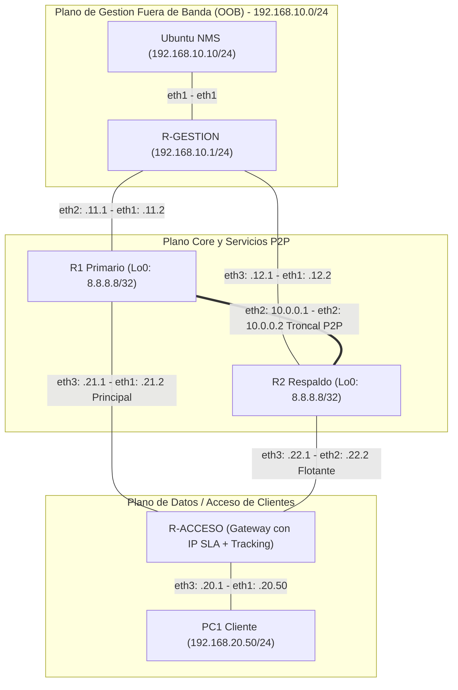

# Plan de Implementación por Fases: Sistema de Enrutamiento L3, Failover Autónomo y Telemetría NMS en Containerlab

Este documento desglosa la migración e implementación completa de la infraestructura de red descrita en el informe de arquitectura (**GNS3 / Cisco 7200**) hacia un entorno automatizado y reproducible sobre **Containerlab (clab)**.

---

## 🗺️ Resumen de Arquitectura y Planos de Red

La topología está segmentada estrictamente en tres planos operativos:



---

## 📊 Matriz de Direccionamiento e Interfaces (Equivalencia Containerlab)

| Nodo | Interfaz Original (Cisco) | Interfaz Containerlab | Dirección IP / Máscara | Propósito / Destino |
| :--- | :--- | :--- | :--- | :--- |
| **Ubuntu NMS** | ens3 / eth0 | `eth1` | `192.168.10.10/24` | Estación central de telemetría y monitoreo SNMP |
| **R-GESTION** | f1/0<br>f0/0<br>f0/1 | `eth1`<br>`eth2`<br>`eth3` | `192.168.10.1/24`<br>`192.168.11.1/30`<br>`192.168.12.1/30` | Conexión a NMS<br>Enlace OOB hacia R1<br>Enlace OOB hacia R2 |
| **R1 (Primario)** | f1/0<br>f0/0<br>f1/1<br>Lo0 | `eth1`<br>`eth2`<br>`eth3`<br>`lo` | `192.168.11.2/30`<br>`10.0.0.1/30`<br>`192.168.21.1/30`<br>`8.8.8.8/32` | Enlace OOB hacia R-GESTION<br>Troncal P2P Core hacia R2<br>Enlace Primario hacia R-ACCESO<br>IP de Servicio Simulado (Loopback) |
| **R2 (Respaldo)** | f1/0<br>f0/0<br>f1/1<br>Lo0 | `eth1`<br>`eth2`<br>`eth3`<br>`lo` | `192.168.12.2/30`<br>`10.0.0.2/30`<br>`192.168.22.1/30`<br>`8.8.8.8/32` | Enlace OOB hacia R-GESTION<br>Troncal P2P Core hacia R1<br>Enlace Respaldo hacia R-ACCESO<br>IP de Servicio Simulado (Loopback) |
| **R-ACCESO** | f0/0<br>f0/1<br>f1/0 | `eth1`<br>`eth2`<br>`eth3` | `192.168.21.2/30`<br>`192.168.22.2/30`<br>`192.168.20.1/24` | Hacia R1 (Sonda IP SLA 1 Activa)<br>Hacia R2 (Ruta Flotante AD=10)<br>Gateway del Cliente PC1 |
| **PC1 (Cliente)** | e0 (VPCS) | `eth1` | `192.168.20.50/24` (GW: .20.1) | Host emulado generador de tráfico y validación SLA |

---

## 🚀 Fases de Implementación

### Fase 0: Preparación del Entorno y Definición Tecnológica
- [x] **0.1 Estructura del Proyecto**: Crear el árbol de directorios de trabajo:
  ```text
  Sistema_Enrut/
  ├── PLAN_FASES.md
  ├── topology.clab.yml
  ├── configs/
  │   ├── r-gestion/
  │   ├── r1/
  │   ├── r2/
  │   └── r-acceso/
  ├── nms/
  │   ├── Dockerfile
  │   ├── monitor_definitivo.py
  │   └── incidentes_red.log
  └── scripts/
      ├── test_failover.sh
      └── verify_snmp.sh
  ```
- [x] **0.2 Selección de Tipo de Router**:
  - **Opción A (Cisco IOL)**: Si se dispone de imagen `cisco_iol` o `c8000v` para réplica 1:1 de los comandos Cisco IOS originales (`ip sla`, `track`, `ip route 0.0.0.0 0.0.0.0 ... track 1`).
  - **Opción B (FRRouting / Linux)**: Usar `frrouting/frr:latest` (ya disponible localmente en el host) con mecanismo de tracking/sonda de enrutamiento y daemon `snmpd`.
- [x] **0.3 Verificación de Herramientas**:
  - Containerlab (`clab version >= 0.79`).
  - Docker daemon en WSL2 operativo.
  - Paquetes de red necesarios instalados en las imágenes (`iproute2`, `net-snmp`, `snmp`, `python3`, `pysnmp`, `iputils-ping`).

---

### Fase 1: Definición de la Topología en Containerlab (`topology.clab.yml`)
- [x] **1.1 Creación del Manifiesto `topology.clab.yml`**:
  - Declarar nombre de laboratorio `lab-enrutamiento-ha`.
  - Definir los 6 nodos: `nms`, `r-gestion`, `r1`, `r2`, `r-acceso`, `pc1`.
  - Configurar las variables `kind`, `image` y puntos de montaje de volúmenes de configuración (`configs/...`).
- [x] **1.2 Definición de Enlaces Punto a Punto (veth links)**:
  - Plano Gestión: `["nms:eth1", "r-gestion:eth1"]`, `["r-gestion:eth2", "r1:eth1"]`, `["r-gestion:eth3", "r2:eth1"]`.
  - Plano Core P2P: `["r1:eth2", "r2:eth2"]`.
  - Plano Acceso: `["r1:eth3", "r-acceso:eth1"]`, `["r2:eth3", "r-acceso:eth2"]`, `["r-acceso:eth3", "pc1:eth1"]`.
- [x] **1.3 Validación de Despliegue**:
  - Ejecutar `sudo clab deploy -t topology.clab.yml`.
  - Verificar que todos los contenedores alcancen estado `running` sin errores de linkeo.

---

### Fase 2: Configuración de Direccionamiento IP y Enrutamiento Base
- [x] **2.1 Configuración de Interfaces y Loopbacks**:
  - Asignar direccionamiento IP según la matriz en cada dispositivo.
  - Levantar `lo:8.8.8.8/32` en R1 y R2.
- [x] **2.2 Rutas Estáticas y Troncal de Retorno**:
  - En **R-GESTION**: Enrutar `192.168.20.0/24` vía R1 (`192.168.11.2`) y respaldo vía R2 (`192.168.12.2`, AD=10).
  - En **R1**: Enrutar `192.168.20.0/24` vía R-ACCESO (`192.168.21.2`) y retorno hacia R2 por troncal (`10.0.0.2`, AD=10).
  - En **R2**: Enrutar `192.168.20.0/24` vía R-ACCESO (`192.168.22.2`) y retorno hacia R1 por troncal (`10.0.0.1`, AD=10).
  - En **NMS**: Rutas de subred de laboratorio hacia R-GESTION:
    `ip route add 192.168.0.0/16 via 192.168.10.1` y `ip route add 10.0.0.0/8 via 192.168.10.1`.
- [x] **2.3 Pruebas de Conectividad Base**:
  - Ping desde `PC1` a su Gateway `192.168.20.1`.
  - Ping desde `PC1` al servicio `8.8.8.8` vía R1.
  - Ping desde `NMS` hacia las IPs OOB de `R-GESTION`, `R1` y `R2`.

---

### Fase 3: Automatización del Failover Autónomo en Capa 3
- [x] **3.1 Configuración de la Sonda Activa (IP SLA)**:
  - Sonda ICMP echo hacia `192.168.21.1` (interfaz de R1) cada 2 segundos con timeout de 800 ms.
- [x] **3.2 Configuración del Object Tracking**:
  - Monitoreo del estado de la sonda con histéresis: `delay down 1 up 1`.
- [x] **3.3 Enrutamiento Dinámico con AD Flotante**:
  - Ruta por defecto preferente hacia R1 (`192.168.21.1`) atada al `track 1` (AD nominal = 1).
  - Ruta por defecto secundaria flotante hacia R2 (`192.168.22.1`) con distancia administrativa `AD = 10`.
- [x] **3.4 Verificación Inicial de Conmutación**:
  - Desactivar enlace de R1 (`clab link set ... down` o shutdown de interfaz).
  - Verificar que el track pase a estado `DOWN` y que la tabla de rutas instale automáticamente `0.0.0.0/0 via 192.168.22.1`.
  - Reestablecer R1 y verificar la restauración de la ruta primaria (preemption inmediata).

---

### Fase 4: Habilitación de SNMPv2c y Exposición de MIBs
- [x] **4.1 Configuración del Agente SNMP**:
  - Habilitar comunidad de lectura: `redes2026` con permisos `RO` en `R-GESTION`, `R1`, `R2` y `R-ACCESO`.
- [x] **4.2 Validación de OIDs Clave desde NMS**:
  - **`ifOperStatus`** (`1.3.6.1.2.1.2.2.1.8`): Estado operacional de interfaces (1=UP, 2=DOWN).
  - **`ipRouteNextHop`** (`1.3.6.1.2.1.4.21.1.7.0.0.0.0`): Próximo salto activo en R-ACCESO (`.21.1` vs `.22.1`).
  - **`ifDescr`** (`1.3.6.1.2.1.2.2.1.2`): Mapeo dinámico de interfaces físicas.
- [x] **4.3 Auditoría de Acceso SNMP Multi-Salto**:
  - Validar que NMS pueda consultar a R-ACCESO vía R1 (`192.168.21.2`) y vía R2 (`192.168.22.2`).

---

### Fase 5: Motor de Telemetría NMS en Python (`monitor_definitivo.py`)
- [x] **5.1 Estructura del Script de Monitoreo**:
  - Sonda ICMP nativa hacia el cliente PC1 (`192.168.20.50`) con timeout estricto de 1 segundo.
  - Consultas SNMP de MIB-II a routers (`R1`, `R2`, `R-ACCESO`).
- [x] **5.2 Mecanismo Multi-Hop SNMP**:
  - Lista de IPs contingentes para R-ACCESO (`[192.168.21.2, 192.168.22.2]`).
  - Conmutación automática del socket SNMP ante caída de la ruta primaria para no perder visibilidad.
- [x] **5.3 Máquina de Estados y Detección de Flancos**:
  - Generación de eventos únicamente ante transiciones (cambio de estado UP ↔ DOWN, cambio de Next-Hop).
  - Formato estandarizado de logs:
    ```text
    [TIMESTAMP] [INFO/CRITICO/FAILOVER/RECUPERADO] <Mensaje del incidente>
    ```
- [x] **5.4 Registro en Bitácora Forense**:
  - Escritura continua en `incidentes_red.log`.

---

### Fase 6: Inyección de Fallas, Auditoría Forense y Validación de SLA
- [x] **6.1 Prueba en Estado Nominal**:
  - Tráfico ICMP continuo desde `PC1` a `8.8.8.8` (latencia nominal, 0% drop).
  - Salto 2 en traceroute confirmado en `192.168.21.1`.
  - Bitácora NMS reporta topología en línea y Gateway en `.21.1`.
- [x] **6.2 Simulación de Corte Silencioso en R1**:
  - Bloqueo/corte del enlace R1 ↔ R-ACCESO (`sudo clab link set -n lab-enrutamiento-ha -a r-acceso:eth1 -s down`).
  - Medición del tiempo de convergencia (pérdida máxima esperada: 1 a 2 paquetes ICMP).
  - Verificación del cambio del salto 2 en traceroute hacia `192.168.22.1`.
- [x] **6.3 Validación Forense en NMS**:
  - Confirmación de alertas generadas en `incidentes_red.log`:
    - `[CRITICO]` Caída de interfaz.
    - `[FAILOVER]` Tráfico redirigido a R2 vía IP SLA / Ruta Flotante.
- [x] **6.4 Simulación de Restauración del Enlace Primario**:
  - Reactivación del enlace R1 ↔ R-ACCESO.
  - Verificación de evento `[RECUPERADO]` y normalización del flujo hacia R1.
- [x] **6.5 Generación de Reporte y Métricas**:
  - Cuantificación de tiempos de convergencia y disponibilidad final del servicio.
