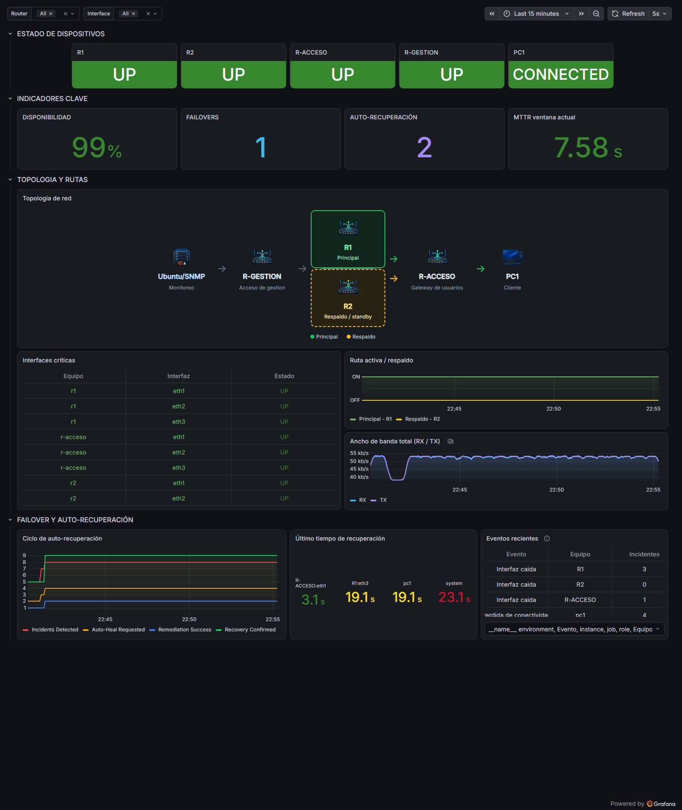
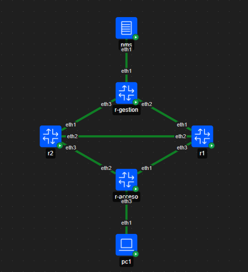
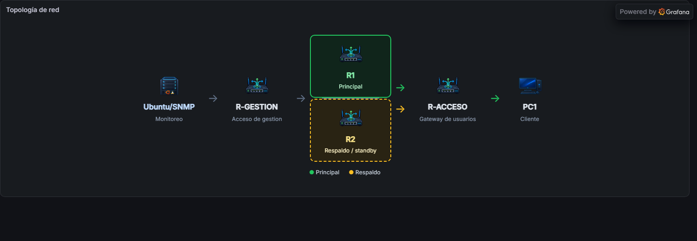
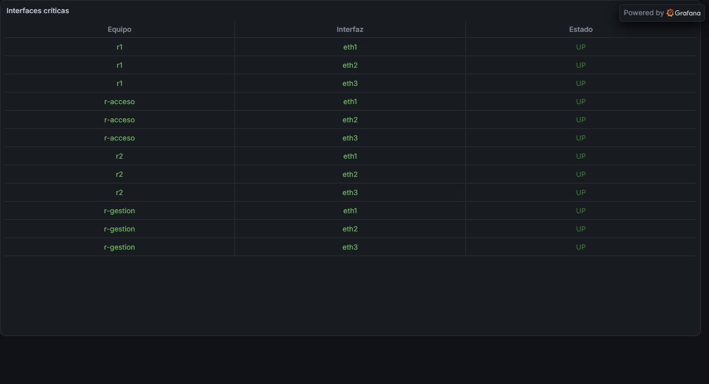
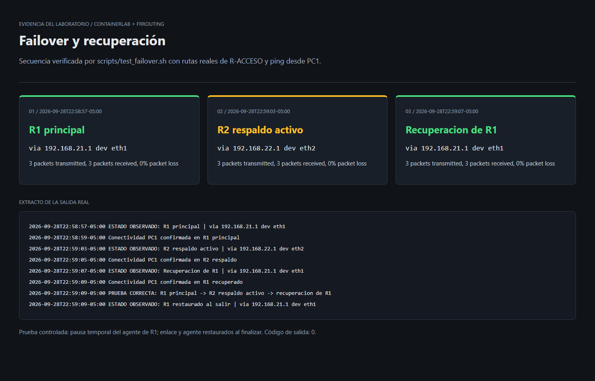

# High Availability Routing Lab

Laboratorio de alta disponibilidad, monitoreo y recuperación automática de red con Containerlab, FRRouting, SNMP, Prometheus y Grafana.

[](docker-compose.yml) [](nms/monitor_definitivo.py) [](monitoring/grafana/dashboards/noc_l3_ha.json) [](monitoring/prometheus/prometheus.yml) [](topology.clab.yml)

<p align="center">
  
</p>

## Overview

Este laboratorio muestra cómo mantener el acceso de un cliente cuando falla la ruta principal. Containerlab despliega la topología, un NMS supervisa los dispositivos y Grafana reúne el estado de la red, el failover y la recuperación en un dashboard NOC.

## Features

- Automatic R1 → R2 failover
- SNMP-based monitoring
- Prometheus metrics
- Grafana NOC dashboard
- Alertmanager integration
- Automated recovery
- Failover validation scripts

## Architecture

**NMS → R-GESTION → R1/R2 → R-ACCESO → PC1**

R-GESTION conecta el plano de gestión. R1 es la ruta principal y R2 la de respaldo; ambos se conectan entre sí y con R-GESTION y R-ACCESO. R-ACCESO es el gateway de PC1. El NMS consulta la red por SNMP, registra incidentes y solicita acciones de recuperación.

<p align="center">
  
</p>

<p align="center"><em>Vista de nodos y enlaces en la extensión Containerlab de VS Code. El despliegue también se puede realizar desde la CLI.</em></p>

## Tech Stack

| Technology | Purpose |
| --- | --- |
| Containerlab | Despliega los nodos y enlaces de la topología. |
| FRRouting | Proporciona el enrutamiento L3. |
| SNMP | Expone el estado de dispositivos, interfaces y ruta activa. |
| Prometheus | Recopila métricas y evalúa reglas de alerta. |
| Grafana | Presenta el dashboard NOC. |
| Alertmanager | Recibe las alertas de Prometheus. |
| SNMP Exporter | Convierte consultas SNMP en métricas para Prometheus. |
| Python | Ejecuta el NMS y los servicios de remediación. |
| Bash | Controla el seguimiento de ruta y las pruebas del laboratorio. |
| Docker | Ejecuta los nodos y los servicios de monitoreo mediante Compose. |

## Quick Start

Requiere Docker, Docker Compose, Containerlab y Python 3 en Linux o WSL2.

1. Clona el repositorio y entra en el proyecto.

   ```bash
   git clone https://github.com/angelol2003l-glitch/Sistema_Enrut.git
   cd Sistema_Enrut
   ```

2. Crea el archivo local de credenciales y sustituye los dos valores `CHANGE_ME` por valores propios. No lo subas a Git.

   ```bash
   install -m 600 .env.example .env
   # Edita .env antes de continuar.
   python3 scripts/render_runtime_config.py
   ```

3. Construye las imágenes y despliega la topología. Containerlab crea la red externa `clab` que necesita Compose.

   ```bash
   docker build -t frr-snmp:latest -f configs/Dockerfile.frr-snmp configs/
   docker build -t nms-telemetry:latest -f nms/Dockerfile nms/
   sudo clab deploy -t topology.clab.yml
   ```

4. Inicia la plataforma de monitoreo y los procesos del laboratorio.

   ```bash
   docker compose up -d
   bash scripts/start_services.sh
   ```

Abre [Grafana](http://localhost:3000) y selecciona el dashboard **Network Operations Center - Alta disponibilidad L3**. Consulta [Credentials](docs/credentials.md) para la configuración local y la rotación de credenciales.

## Monitoring

Los agentes SNMP alimentan a SNMP Exporter; Prometheus recopila esas métricas y las del NMS. Grafana muestra dispositivos, interfaces, rutas, tráfico y eventos. Prometheus envía las alertas configuradas a Alertmanager.

Grafana permite consultar el dashboard de forma anónima con rol Viewer. La cuenta de administración se configura mediante el `.env` local.

| Service | Local URL |
| --- | --- |
| Grafana | [localhost:3000](http://localhost:3000) |
| Prometheus | [localhost:9090/targets](http://localhost:9090/targets) |
| SNMP Exporter | [localhost:9116](http://localhost:9116) |
| Alertmanager | [localhost:9093](http://localhost:9093) |

## High Availability & Failover

En operación normal, R-ACCESO envía el tráfico por R1. El controlador [`automation/sla_tracker.sh`](automation/sla_tracker.sh) detecta la caída del siguiente salto principal, activa R2 y devuelve la ruta a R1 al recuperarse. El NMS consulta por SNMP la ruta efectiva de R-ACCESO para reflejar **R1 activo → R2 activo → R1 restaurado**.

## Auto-Recovery

El NMS detecta fallas de interfaces y solicita acciones a [`automation/remediation_server.py`](automation/remediation_server.py), disponible en R1, R2 y R-ACCESO. Sus métricas y la bitácora permiten seguir incidentes, acciones automáticas y tiempos de recuperación.

## Screenshots

**Dashboard NOC.** Vista general del estado, los indicadores y la topología.

<p align="center">
  
</p>

**Topología en Grafana.** Versión simplificada para identificar el camino principal por R1 y el respaldo por R2.

<p align="center">
  
</p>

**Monitoreo de red.** Interfaces y estado operativo obtenidos mediante SNMP y Prometheus.

<p align="center">
  
</p>

**Failover y recuperación.** Resultado de una ejecución de la prueba R1 → R2 → R1 con comprobaciones de conectividad.

<p align="center">
  
</p>

<!-- Demo de failover: cuando exista una captura real y breve en docs/images/failover-demo.gif, insertarla aquí. -->

## Project Structure

| Path | Content |
| --- | --- |
| `automation/` | Seguimiento de ruta y remediación. |
| `configs/` | FRRouting y plantillas SNMP de los routers. |
| `monitoring/` | Prometheus, Grafana, Alertmanager y SNMP Exporter. |
| `nms/` | Telemetría y lógica de monitoreo en Python. |
| `scripts/` | Despliegue, verificadores y prueba de failover. |
| `docs/` | Evidencias visuales y guía de credenciales. |
| `topology.clab.yml`, `docker-compose.yml` | Topología y servicios del laboratorio. |

Los archivos generados por Containerlab y las credenciales locales están excluidos de Git.

## Testing

Comprueba los nodos y los servicios con los verificadores existentes:

```bash
sudo clab inspect -t topology.clab.yml
docker compose ps
bash scripts/verify_prometheus.sh
bash scripts/verify_snmp_exporter.sh
bash scripts/verify_snmp.sh
bash scripts/verify_grafana.sh
bash scripts/verify_alertmanager.sh
bash scripts/verify_nms.sh
bash scripts/verify_ha.sh
```

Ejecuta la prueba de failover con el laboratorio activo:

```bash
bash scripts/test_failover.sh
```

La prueba exige que la ruta real y la telemetría sigan **R1 → R2 → R1**, verifica conectividad desde PC1 y mantiene R2 activo durante 15 segundos. Pausa temporalmente el agente de remediación de R1 y lo reanuda al salir. El destino ICMP predeterminado es `8.8.8.8`; puedes cambiarlo con `FAILOVER_PROBE_IP`. Los timeouts de ruta y telemetría son de 30 y 60 segundos, ajustables con `FAILOVER_TIMEOUT` y `FAILOVER_TELEMETRY_TIMEOUT`; la duración de la falla se ajusta con `FAILOVER_HOLD_SECONDS`.

## Documentation

- [Credentials](docs/credentials.md): preparación de `.env`, plantillas SNMP y rotación local.

## Roadmap

- Añadir una guía breve de resolución de problemas de despliegue y conectividad.
- Ampliar la validación automatizada de rutas, targets y recuperación.
- Incorporar una demo GIF corta de una prueba real de failover.
